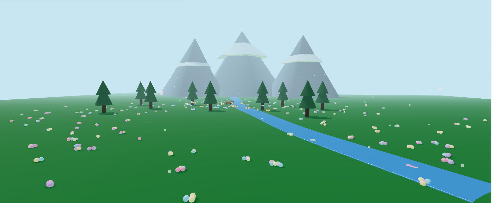
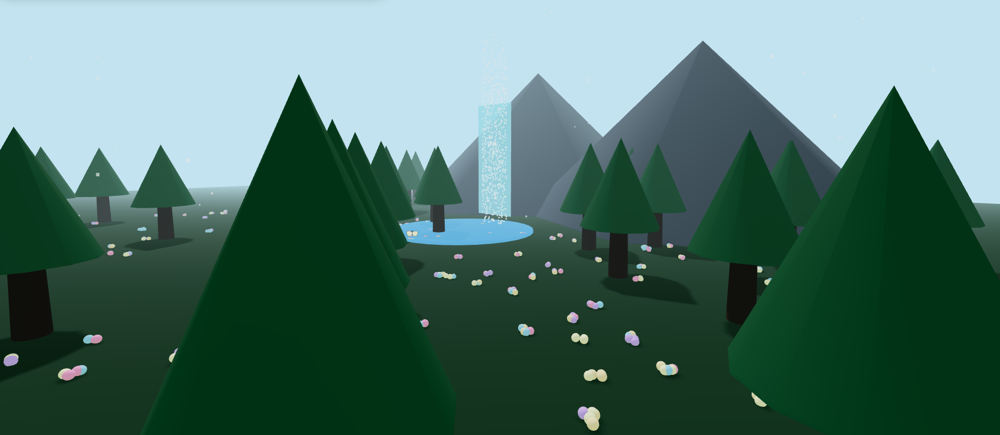

# Lumina Garden

### Welcome to an immersive 3D landscape experience!


## Teaser Video

[Watch the teaser video here](teaser.mp4)

# Description

Lumina Garden is a 3D interactive landscape built with Three.js. You can explore three different environments: valley, forest, and park. Each environment has its own music that plays automatically. You can also change the time of day between morning, sunset, and night to see different lighting effects.

Click anywhere on the landscape to grow glowing light-flowers. Watch butterflies fly around the scene as you explore.

The three environments are:
- **Valley**: Mountains, a winding river, and a dog walking along the path
- **Forest**: Dense trees and a waterfall
- **Park**: Paths, benches, and flower beds

Each environment plays its own music:
- Valley: "All the Stars"
- Forest: "Espresso"
- Park: "Nadaaniyan"

If you like to view the project files and edit the code yourself, please go to the [Installation](#installation) section below. If you would like to play the application, please go to the [Usage](#usage) section below.

# Installation

To access the project files, you will need a modern web browser and a local web server. To set up the project:

1. Download or clone this repository to your local machine.

2. Make sure your files are organized like this:
   ```
   project/
   ├── index.html
   ├── main.js
   ├── README.md
   ├── audio/
   │   ├── all the stars.mp3
   │   ├── Espresso.mp3
   │   └── Nadaaniyan.mp3
   └── images/
       ├── valley.png
       ├── forest.png
       ├── park.png
       └── picture 1.avif
   ```

3. Place your audio files in the `audio/` folder. The filenames must match exactly (case-sensitive): `all the stars.mp3`, `Espresso.mp3`, and `Nadaaniyan.mp3`.

4. Start a local web server. Here are a few options:

   **Python:**
   - Navigate to the project directory in your terminal
   - Run: `python -m http.server 8000`
   - Open your browser and go to `http://localhost:8000`

   **Node.js:**
   - Navigate to the project directory
   - Run: `npx http-server`
   - Open your browser and go to `http://localhost:8080`

   **VS Code:**
   - Install the Live Server extension
   - Right-click on `index.html` and select "Open with Live Server"

# Usage

To use this application, you need a modern web browser with WebGL support (Chrome, Firefox, Edge, or Safari recommended).

1. Start your local web server using one of the methods in the Installation section above.

2. Open the project in your browser through the local server.

3. Click anywhere on the page to enable audio playback (browsers require user interaction for audio).

4. Use these controls:

   | Key | Action |
   |-----|--------|
   | **1** | Switch to Morning |
   | **2** | Switch to Sunset |
   | **3** | Switch to Night |
   | **4** | Switch to Valley environment |
   | **5** | Switch to Forest environment |
   | **6** | Switch to Park environment |
   | **Click** | Create a light-flower |
   | **Mouse Drag** | Rotate camera |
   | **Scroll Wheel** | Zoom in and out |

# Visuals

## Valley Environment


## Forest Environment


## Park Environment


# Future Improvements

The project has room for improvements as it continues to develop.

For the environments, we would like to add more scenes with unique characteristics. Additional interactive elements such as more animals or weather effects would make the experience more immersive.

For the audio system, we plan to add volume controls so users can adjust the music level. Customizable playlists would allow users to choose their own songs for each environment.

For user experience, we would like to add mobile touch controls for better mobile device support. A simple UI overlay would help new users understand the controls more easily.

# Common problems and solutions

1. **Q:** The music is not playing when I switch environments. How do I fix that?

   **A:** Make sure you've clicked on the page at least once. Browser security policies require user interaction before audio can play. After clicking, the audio system will initialize and music should play when you switch environments using keys 4, 5, or 6.

2. **Q:** I'm getting errors about missing audio files. What should I do?

   **A:** Check that your audio files are in the `audio/` folder with the exact filenames: `all the stars.mp3`, `Espresso.mp3`, and `Nadaaniyan.mp3`. The filenames are case-sensitive, so make sure the capitalization matches exactly. Also ensure you're running the project through a local server, not just opening the HTML file directly.

3. **Q:** The 3D scene is not displaying or looks broken. How can I fix this?

   **A:** Ensure your browser supports WebGL. Most modern browsers (Chrome, Firefox, Edge, Safari) support WebGL, but you can verify by visiting a WebGL test site. Also check the browser console (press F12) for any error messages. Try updating your graphics drivers, as outdated drivers can cause WebGL issues.

4. **Q:** When I press keys 4, 5, or 6, nothing happens. What's wrong?

   **A:** Make sure the browser window has focus. Click on the page to ensure keyboard events are being captured. Also check the browser console (F12) for any JavaScript errors that might prevent the environment switching logic from executing.

5. **Q:** I'm getting CORS errors in the console. How do I resolve this?

   **A:** CORS errors typically occur when opening the HTML file directly instead of using a local server. Make sure you're running the project through a local web server as described in the Installation section. Opening `index.html` directly in the browser can cause these security restrictions.

# Authors and acknowledgment

**Author:** Lakshmi Pranathi Vutla  
**Student ID:** 02197 113

This project was developed with assistance from AI coding tools to help with code implementation, debugging, and technical problem-solving. The AI tools were particularly helpful in implementing the audio playback system with Web Audio API and HTML5 Audio fallback mechanisms, debugging audio synchronization issues, and resolving browser compatibility problems.

The core creative vision, design decisions, and project requirements were developed by the author, with AI assistance serving as a tool to help realize the technical implementation of those ideas.

Special thanks to the Three.js community for providing excellent documentation and examples that made this project possible. The Three.js library and its ecosystem of addons and tools were essential in creating this interactive 3D experience.
